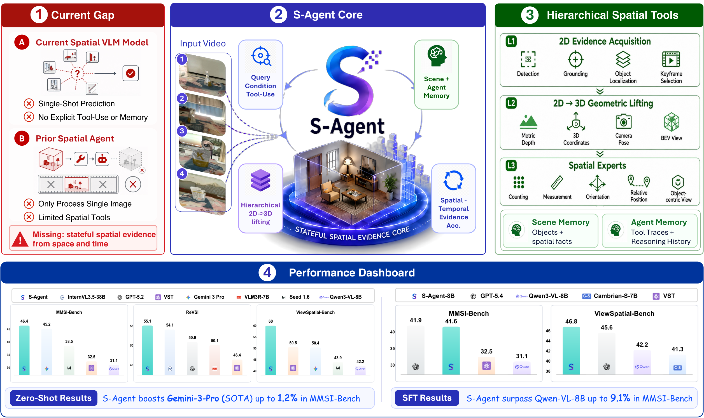

<div align="center">

# S-Agent: Spatial Tool-Use Elicits Reasoning for Spatial Intelligence

**Official repository for the paper**

<a href="https://Ropedia.github.io/S-Agent"></a>
<a href="https://huggingface.co/papers/2606.20515"></a>
<a href="https://arxiv.org/abs/2606.20515"></a>
<a href="assets/sagent_demo_video_compressed.mp4"></a>


</div>


https://github.com/user-attachments/assets/a1df75bc-0126-4e0d-8d62-1b83268156be


## News

- **2026/06**: Paper and arXiv page released.
- **2026/06**: Project page and demo video are online.
- **Coming soon**: Code, trajectories, checkpoints, and visualization scripts will be released after cleanup.

## Introduction

**S-Agent** is a spatial tool-use agentic paradigm for continuous multi-view
image and video reasoning. Instead of forcing a vision-language model to answer
from a single visual impression, S-Agent lets the model plan spatial evidence
requests, call specialized tools, accumulate scene memory, and keep an agent
memory of its reasoning steps.

The framework targets questions that require persistent 3D state across views,
frames, and tool calls: metric measurement, counting, camera/object/region
relations, orientation, route reasoning, and other spatial intelligence tasks.
S-Agent also supports trajectory distillation into **S-Agent-8B**, a compact
model trained from S-Agent reasoning traces.

## Method Overview

<p align="center">
  
</p>

S-Agent is organized around three components:

- **Planner**: a VLM decides which spatial evidence is still missing and when the answer is ready.
- **Spatial tools**: a hierarchy of 2D evidence acquisition, 2D-to-3D geometric lifting, and spatial knowledge aggregation tools.
- **Memory**: scene memory stores object-centric evidence, while agent memory records thoughts, tool calls, observations, and partial conclusions.

## Highlights

- Spatial tool-use for continuous multi-view image and video reasoning.
- Evidence accumulation across frames, viewpoints, depth, object grounding, and metric geometry.
- Strong zero-shot performance on MMSI-Bench and ViewSpatial-Bench.
- Trajectory distillation from S-Agent runs into S-Agent-8B.
- Real reasoning trajectories and case studies are available on the project page.

## TODO List

This `main` branch is currently a lightweight landing branch. The project code
has not been open-sourced yet.

- [x] Release paper and arXiv.
- [x] Publish the project page.
- [x] Add the demo MP4.
- [ ] Open-source inference and evaluation code.
- [ ] Release S-Agent trajectories / S-300K data.
- [ ] Release S-Agent-8B checkpoints.
- [ ] Release training and trajectory-distillation scripts.
- [ ] Release visualization tools and example cases.
- [ ] Add license and detailed environment instructions.

## Quick Start

The runnable code is still under preparation. After the public release, this
section will include environment setup, checkpoint download, inference, and
evaluation commands.

```bash
git clone https://github.com/Ropedia/S-Agent.git
cd S-Agent

# TODO: install environment
# TODO: download checkpoints and data
# TODO: run inference / evaluation
```

For now, please see the [project page](https://Ropedia.github.io/S-Agent) and
the [demo video](assets/sagent_demo_video_compressed.mp4) for examples of
S-Agent reasoning trajectories.

## Citation

If you find S-Agent helpful, please consider citing:

```bibtex
@article{dai2026sagent,
  title   = {S-Agent: Spatial Tool-Use Elicits Reasoning for Spatial Intelligence},
  author  = {Dai, Yalun and Li, Hao and Tian, Shulin and Yao, Runmao and
             Dong, Yuhao and Hong, Fangzhou and Chen, Zhaoxi and Liu, Fangfu and
             Tian, Baoliang and Zhang, Dingwen and Wang, Tao and Yap, Kim-Hui and
             Liu, Ziwei},
  journal = {Technical Report},
  year    = {2026}
}
```
