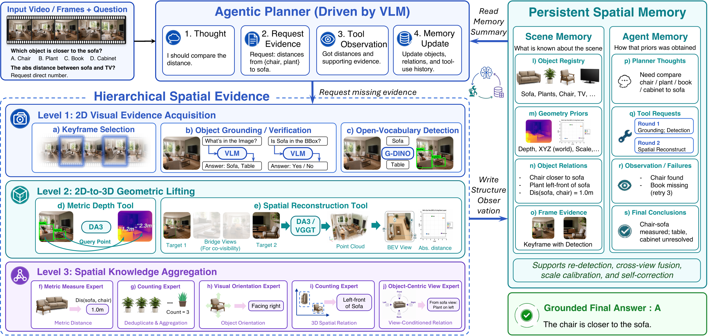
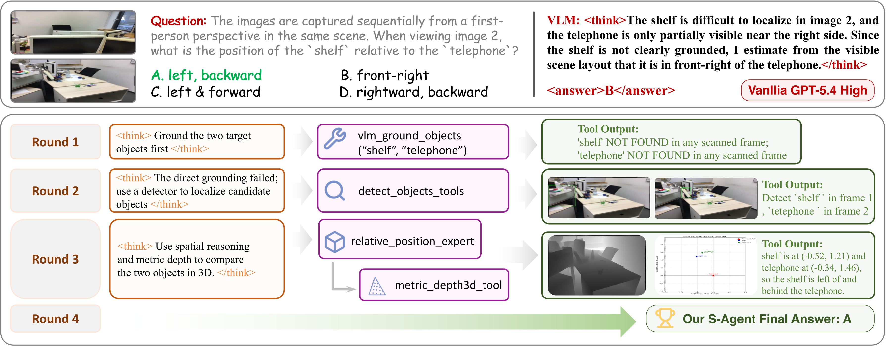
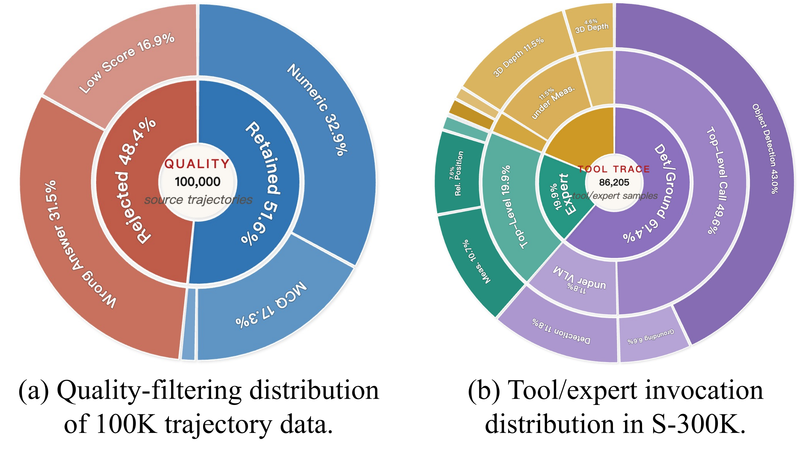

# S-Agent: Spatial Tool-Use Elicits Reasoning for Spatial Intelligence

<p align="center">
  
</p>

<p align="center">
  <a href="assets/S-Agent-paper.pdf">Paper PDF</a> |
  <a href="https://github.com/Ropedia/S-Agent/tree/page">Project page source</a> |
  Code and arXiv coming soon
</p>

<p align="center">
  
</p>

S-Agent is a spatial tool-use agentic paradigm for continuous multi-view image
and video reasoning. Instead of answering from a single visual impression,
S-Agent treats spatial reasoning as spatio-temporal evidence accumulation: a VLM
planner calls spatial tools, stores useful scene evidence, tracks its own
reasoning state, and answers once the accumulated evidence is sufficient.

## Highlights

- **Spatial tool hierarchy.** S-Agent combines 2D evidence acquisition, 2D-to-3D
  geometric lifting, and spatial knowledge aggregation tools for measurement,
  counting, relative position, visual orientation, and object-view reasoning.
- **Dual memory.** Scene memory keeps reusable object-centric visual and 3D
  evidence, while agent memory records thoughts, tool calls, failures, and
  partial conclusions.
- **Strong zero-shot performance.** S-Agent reaches **46.4%** average accuracy on
  MMSI-Bench and **60.0%** on ViewSpatial-Bench, with large gains on motion and
  perspective-heavy questions.
- **Trajectory distillation.** S-Agent trajectories can distill a compact
  **S-Agent-8B**, reaching **41.6%** on MMSI-Bench and **46.8%** on
  ViewSpatial-Bench.

## Framework

<p align="center">
  
</p>

At each step, a semantic planner maps the question, observations, and memory to
an evidence request. Spatial tools and experts execute the request, update scene
and agent memory, and return evidence for the next planning step.

## Reasoning Trajectories

<p align="center">
  
</p>

The `page` branch contains a static project page with browsable S-Agent
trajectory examples. Each trajectory records the question, selected visual
evidence, tool calls, intermediate observations, and final answer.

## S-300K Distillation Data

<p align="center">
  
</p>

S-Agent trajectories provide supervision for distilling spatial tool-use behavior
into smaller vision-language models. Release details for code, data, and
checkpoints will be added to this branch.

## Results Snapshot

| Setting | Result |
| --- | ---: |
| MMSI-Bench zero-shot average | 46.4 |
| ViewSpatial-Bench zero-shot average | 60.0 |
| S-Agent-8B on MMSI-Bench | 41.6 |
| S-Agent-8B on ViewSpatial-Bench | 46.8 |

## Repository Layout

- `main`: README and README-facing assets only.
- `page`: static project page and page-specific media.

## Citation

```bibtex
@article{dai2026sagent,
  title   = {S-Agent: Spatial Tool-Use Elicits Reasoning for Spatial Intelligence},
  author  = {Dai, Yalun and Li, Hao and Tian, Shulin and Yao, Runmao and
             Dong, Yuhao and Hong, Fangzhou and Chen, Zhaoxi and Liu, Fangfu and
             Tian, Baoliang and Wang, Tao and Zhang, Dingwen and Yap, Kim-Hui and
             Liu, Ziwei},
  journal = {Technical Report},
  year    = {2026}
}
```
