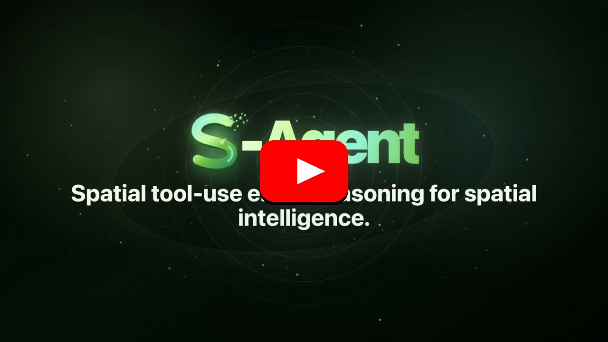

# S-Agent: Spatial Tool-Use Elicits Reasoning for Spatial Intelligence

---

## Overview

**S-Agent** is a spatial tool-use agent for continuous multi-view image and
video reasoning. It accumulates spatio-temporal evidence through spatial tools,
scene memory, and agent memory, enabling vision-language models to reason over
3D space beyond a single visual impression.

## TODO

- [x] Release paper and arXiv.
- [ ] Publish the project page.
- [ ] Open-source inference and evaluation code after the paper is public.
- [ ] Release S-Agent trajectories / S-300K data after data cleanup.
- [ ] Release model checkpoints and usage examples.
- [ ] Add citation once the paper metadata is finalized.
